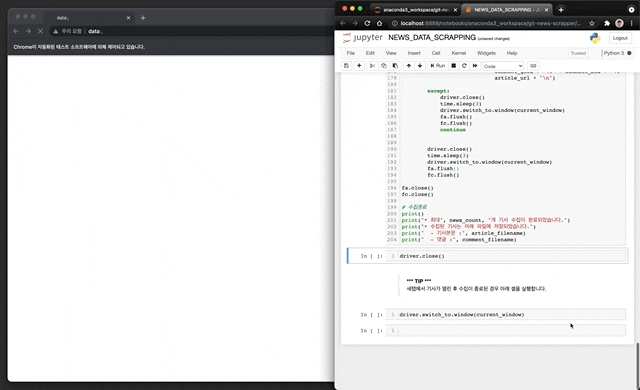

# `TEANAPS` News Article Scrapper

> `TEANAPS` News Article Scrapper는 네이버 뉴스기사 및 댓글 수집을 위한 웹스크래핑(크롤링) 도구입니다. 네이버 뉴스기사 검색결과를 수집 대상으로 하며 키워드 검색으로 원하는 기간, 개수 만큼 뉴스기사 데이터수집이 가능합니다. 본 자료는 10년치 이상의 뉴스기사를 수집하며 테스트 및 최적화를 진행하여 안정된 데이터 수집을 지원합니다. 직접 뉴스기사 데이터를 수집하고 [`TEANAPS`](https://github.com/fingeredman/teanaps#teanaps-text-analysis-apis-for-ecucation)를 활용해 텍스트 분석에 활용해보세요.

- 본 자료는 텍스트 마이닝을 활용한 연구 및 강의를 위한 목적으로 제작되었습니다.
- 본 자료를 강의 또는 연구 목적으로 활용하고자 하시는 경우 꼭 아래 메일주소로 연락주세요.
- 본 자료에 대한 <U>상업적 활용과 허가되지 않은 배포를 금지</U>합니다.
- 강의, 저작권, 출판, 특허, 공동저자에 관련해서는 문의 바랍니다.
- **Contact : ADMIN(admin@teanaps.com)**

---
## Notice! 
> - 본 자료는 `2021 한국지능정보시스템학회 춘계 학술대회` 튜토리얼 세션을 위한 자료로 활용되었습니다.

---
## User Guide

### 1. Install Selenium

- [Selenium](https://pypi.org/project/selenium/) - *pip install selenium*

  > Python Code (in Jupyter Notebook) :
  > ```python
  > !pip install selenium
  > ```

### 2. Chrome Driver Setting

- 자신의 PC에 설치된 Chrome 브라우저에 맞는 Chrome Driver 버전을 다운로드합니다. [[Chrome Driver 다운로드](http://chromedriver.chromium.org/downloads/)]
- 다운로드한 Chrome Driver 파일 경로를 아래 코드의 `DRIVER_PATH`에 입력합니다.

  > Python Code (in Jupyter Notebook) :
  > ```python
  > # Windows 운영체제
  > #DRIVER_PATH = "chromedriver.exe"
  > 
  > # MAC, Linux 운영체제
  > # - 경고메시지 출력 시 보안 및 개인정보보호 메뉴에서 "확인없이 허용" 클릭 필요함
  > DRIVER_PATH = "./chromedriver"
  > ```
 
### 3. 수집할 뉴스기사 정보입력

- 아래 코드에서 수집할 뉴스기사 정보를 입력합니다.
- 단, 아래 조건을 만족하더라도 네이버 플랫폼에서 제공하지 않는 기사는 수집 대상에서 제외됩니다.

  > Python Code (in Jupyter Notebook) :
  > ```python
  > # 수집할 뉴스기사 정보를 입력합니다.
  > QUERY = "코로나19"          # 필터링 키워드
  > START_DATE = "2020.12.01" # 필터링 일자 (작성일 기준)
  > END_DATE = "2020.12.03"
  > START_PAGE = 1            # 검색결과 저장 페이지 범위 (네이버 뉴스기사는 검색결과 중 최대 4,000페이지만 제공)
  > END_PAGE = 2     
  >                           # 기사와 댓글을 저장할 파일명
  > article_filename = "article_" + QUERY + "_" + START_DATE + "_" + END_DATE + "_" + str(START_PAGE) + ".txt"
  > comment_filename = "comment_" + QUERY + "_" + START_DATE + "_" + END_DATE + "_" + str(START_PAGE) + ".txt"
  > ``` 

### 4. 수집시작

- 1~3번 과정 준비가 완료되면 전체 코드를 실행합니다. [[수집 데이터 정보(Excel)](https://github.com/fingeredman/news-article-scrapper/raw/main/news_scrapper/sample_data/scrapping_data_desc.xlsx)]

  > 

---
## Release history
> 2021.06.06. `teanaps-news-scrapper v1.0.1` 업데이트   
> 2021.05.30. `teanaps-news-scrapper v1.0.0` 업데이트   

---
## Update History
> 2021.06.06. `User Guide` 업데이트  
> 2021.05.30. 기본 구성 입력  

<br><br>
---
<center>ⓒ 2021. TEANAPS rights reserved.</center>
